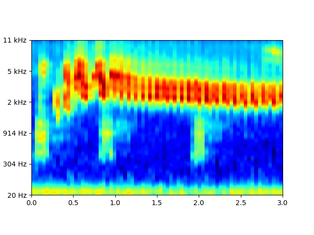
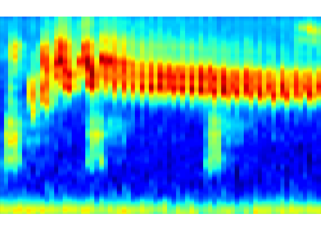
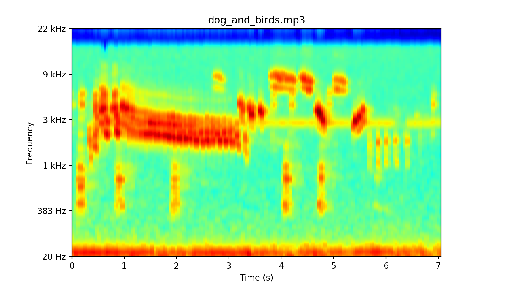
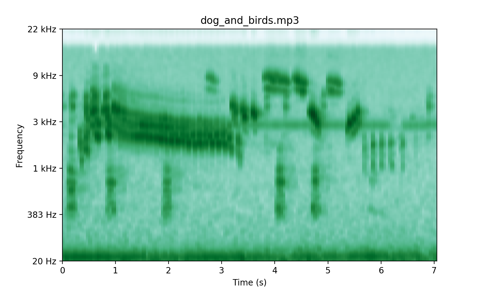

# Gammatone Spectrogram Generation
##### by BW, 2019

---

## Introduction
- **Gammatone Frequency Cepstral Coefficients (GFCC)** can complement with **Mel Frequency Cepstral Coefficients (MFCC)**, due to the capability of GFCC being able to proficiently characterize transient sounds classes such as gun-shots, dog-barking, footsteps and so on [ref](S. Chachada and C. . J. Kuo. Environmental sound recognition: A survey. In 2013 Asia-Pacific Signal and Information Processing Association Annual Summit and Conference, pages 1–9, Oct 2013.). So as to be with <span style="color:#B40431;background-color:#FBEFF2">Gammatone Spectrogram</span> vs **Mel Spectrogram**.
- *Most of the code from [Gammatone Filterbank Toolkit by Jason Heeris, 2013.](https://github.com/detly/gammatone) You may find more supported materials from it.*

## Summary of Changes
+ [x] Can process various kinds of audio files, including **[".mp3", ".wav", ".flac", ".aif", ".aiff", ".ogg", ".wma"] and more**, not just *.wav* files as its origin.
+ [x] <span style="color:#B40431;background-color:#FBEFF2">Can easily adjust the resulted spectrogram's resolution by setting `twin` hyperparameter, e.g. `twin=0.08, twin=0.4`.</span>
+ [x] Can use different colormaps for plotting.
+ [x] Can produce the gammatonegrams either from audio files or from buffer, which is suitable for developers in their own program.

Installation
------------

For now, you can clone the repository and then use it.

### Dependencies

 - numpy
 - scipy
 - nose
 - mock
 - librosa
 - matplotlib

Using the Code [demos]
--------------
#### 1. How to run the demos.
1. You can run one of the following two commands in `main_demo_BW.py` or `plot_UrbanSound8K.py`. The `gtgram.gtgram` method in the following 1st line is much **slower** than the 2nd method of `ftweight.fft_gtgram`. So, in most time, run the 2nd line to generate Gammatonegrams.
```python
  ender_GFCC_from_file(path='dog_and_birds.mp3', duration=2, function=gtgram.gtgram) #Process 2-second chunk.
  ender_GFCC_from_file(path='dog_and_birds.mp3', duration='full', function=fftweight.fft_gtgram)
```
2. `plot_UrbanSound8K.py` can also save the matplotlib plot and its pruned version. An example photo of running it is pasted as below.



#### 2. Can produce the gammatonegrams either from audio files or from buffer.
Practitioners can run either `render_GFCC_from_file()` or `render_GFCC_from_sig()`.

#### 3. Can use different colormaps for plotting. An example of using **jet** and **BuGn** colormap is shown below.
```python
  cmap = 'jet'  
  # cmap = 'BuGn'
```



---
(_the End_)
