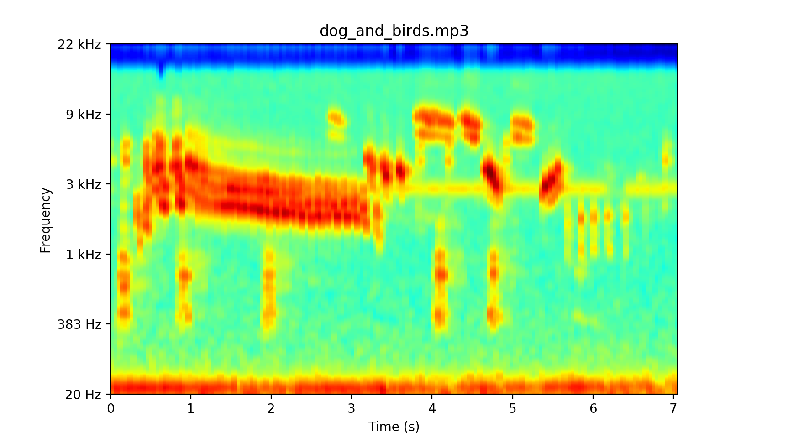
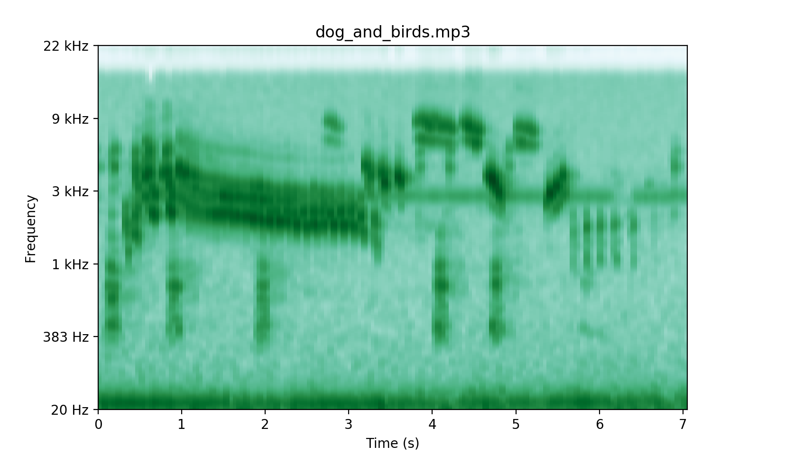

[_in progress_] Gammatone Spectrogram Generation
============================

- **Gammatone Frequency Cepstral Coefficients (GFCC)** can complement with **Mel Frequency Cepstral Coefficients (MFCC)**, due to the capability of GFCC being able to proficiently characterize transient sounds classes such as gun-shots, dog-barking, footsteps and so on [ref](S. Chachada and C. . J. Kuo. Environmental sound recognition: A survey. In 2013 Asia-Pacific Signal and Information Processing Association Annual Summit and Conference, pages 1–9, Oct 2013.).
- *Most of the code from [Gammatone Filterbank Toolkit by Jason Heeris, 2013.](https://github.com/detly/gammatone) You may find more supported materials from it.*

Bo Wu, 2019

Summary of Changes
-------

+ [x] Can process various kinds of audio files, including **[".mp3", ".wav", ".flac", ".aif", ".aiff", ".ogg", ".wma"] and more**, not just *.wav* files.
+ [x] Can use different colormaps for plotting. An example of using **jet** and **BuGn** colormap is shown below.


+ [x] Can produce the gammatonegrams either from audio files or from buffer, which is suitable for developers in their own program.

Installation
------------

You can install directly from this git repository using:

```text
pip install git+https://github.com/detly/gammatone.git
```

...or you can clone the git repository however you prefer, and do:

```text
pip install .
```

...or:

```
python setup.py install
```

...from the cloned tree.

### Dependencies

 - numpy
 - scipy
 - nose
 - mock
 - librosa
 - matplotlib

Using the Code
--------------

See the [API documentation](http://detly.github.io/gammatone/). For a
demonstration, find a `.wav` file (for example,
[Für Elise](http://heeris.id.au/samples/FurElise.wav)) and run:

```text
python -m gammatone FurElise.wav -d 10
```

...to see a gammatone-gram of the first ten seconds of the track. If you've
installed via `pip` or `setup.py install`, you should also be able to just run:

```text
gammatone FurElise.wav -d 10
```
